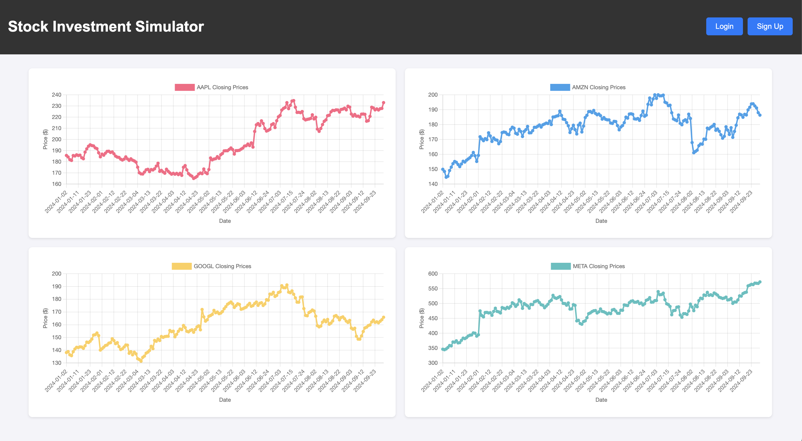

# Project Setup Instructions



## 1. Run the Database Setup Script

To set up the database, execute the following command:

### For MacOS/Linux

```bash
bash setup.bash
```

### For Windows

```bash
setup.bat
```

## 2. Restart the PHP Server

Start the PHP development server with the following command:

```bash
php -S localhost:8000 -t public
```

## 3. Access the Application

Open your browser and navigate to:

[http://localhost:8000](http://localhost:8000)
